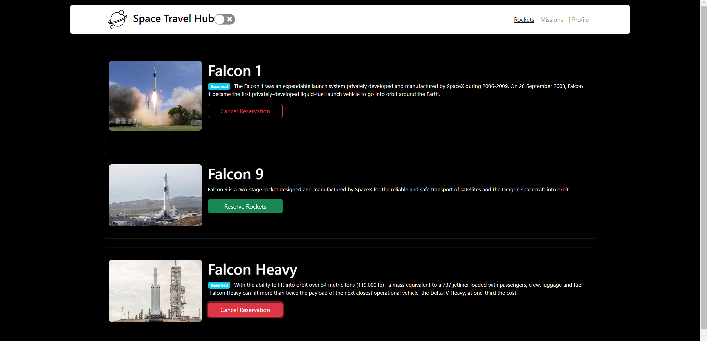

# Space Travel Hub

> The application will allow users to book rockets and join selected space missions

## [Live link](https://space-travel-hub-rockets.netlify.app/)

## [Tutorial](https://medium.com/@learnwithalfred/react-with-redux-toolkit-and-createasyncthunk-complementary-guide-c3a3bb2a1113)

## Built With

- JavaScript, HTML, CSS
- React.js
- Redux, Redux-toolkit
- Jest

## Getting Started

This project was bootstrapped with [Create React App](https://github.com/facebook/create-react-app).

## Prerequisites

- Node
- Git
- Code Editor

## Insall

Run the following command to get a working version locally

- `git clone https://github.com/learnwithalfred/space-travel-booking.git`
- `cd space-travel-booking`
- `npm install`
- `npm start`

## Test

Run this command to test the application

`npm test`

## Authors

Alfred Boateng

- GitHub: [@learnwithalfred](https://github.com/learnwithalfred)
- Twitter: [@kb_alfred](https://twitter.com/kb_alfred)
- LinkedIn: [Alfred Boateng](https://www.linkedin.com/in/learnwithalfred/)

Bright Ahiadeke

- GitHub: [@kwekubright](https://github.com/kwekubright)
- Twitter: [@kwekubright_](https://twitter.com/kwekubright_)
- LinkedIn: [Bright ahiadeke](https://www.linkedin.com/in/kwekubright/)

## 🤝 Contributing

Contributions, issues, and feature requests are welcome!

Feel free to check the [issues page](../../issues/).

## Show your support

Give a ⭐️ if you like this project!

## Acknowledgments

- All API used in project were from Space X including
  - [Rockets](https://api.spacexdata.com/v3/rockets)
  - [Missions](https://api.spacexdata.com/v3/missions)
- Inspiration and design from [Microverse Bootcamp](https://www.microverse.org/)

## 📝 License

This project is [MIT](./MIT.md) licensed.
